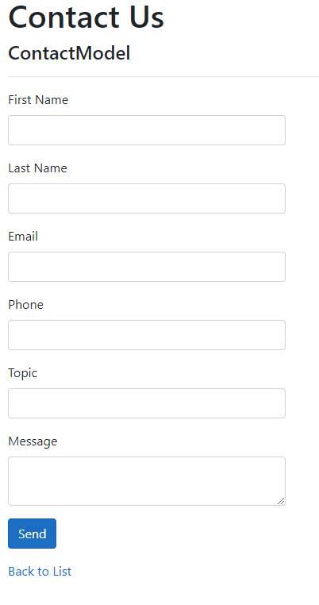
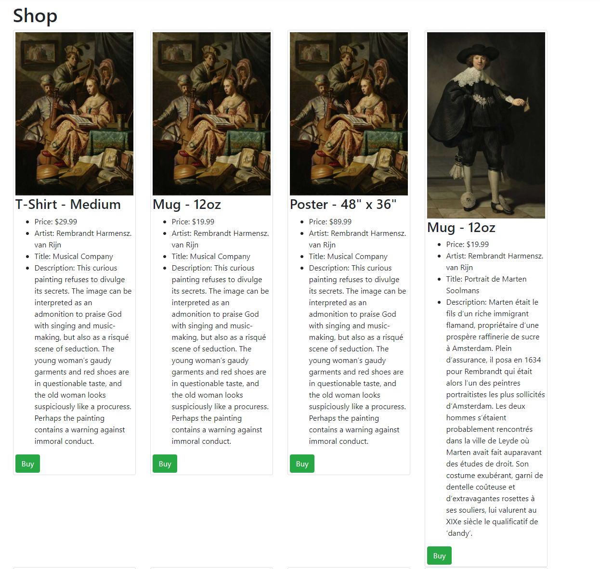

# .NetCore MVC Shop
This project was made to learn MVC and how to apply it to a ASP .Net Core Web App.

## Features
This web application uses SendGrid to send emails through a contact form that the user can fill out.

The web app also has a store page, which displays items that be bought.
This is done using an Entity Framework database to store the data.

 
